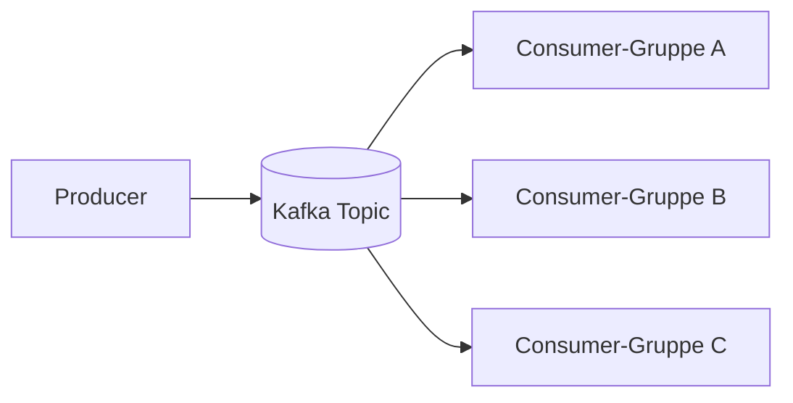
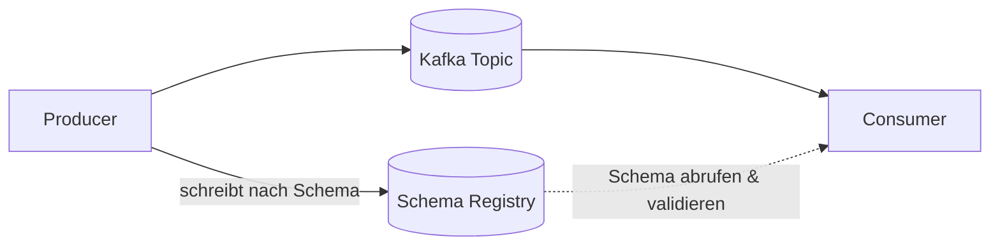
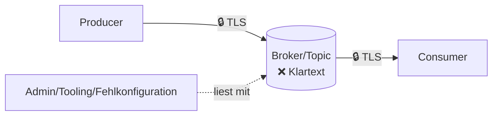
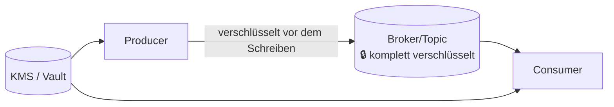
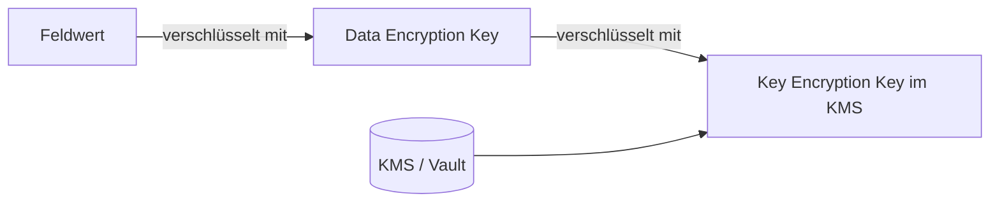

# Kafka ohne Klartext

## Feldverschlüsselung in Kafka mit Avro

Wie sensible Vertragsdaten im Event-Streaming geschützt werden – ohne Klartext auf dem Broker.

<br>

**Tech Evening**

---
layout: section
---

# Kurz zur Erinnerung: Kafka

---

## Kafka in 60 Sekunden

Wissen wir eigentlich alle schon – trotzdem kurz zur Erinnerung:

- **Producer** schreiben Events in ein **Topic**
- **Broker** speichern diese Events geordnet und dauerhaft
- **Consumer** lesen Events – unabhängig voneinander, im eigenen Tempo
- Mehrere Consumer-Gruppen können **dasselbe Topic** parallel und entkoppelt lesen



Genau diese Entkopplung wird gleich zum Thema.

<!-- Timing: ca. 1,5 Min. Bewusst knapp halten - Publikum kennt Kafka bereits. -->

---
layout: section
---

# 1. Ein Fall für Kafka – mit einem Haken

---

## Beispiel: VertragsAbschluss-Event

Ein Berater schließt für einen Kunden einen Vorsorge- oder Versicherungsvertrag ab. Das Event geht auf ein Kafka-Topic:

```json
{
  "vertragId": "VA-2024-100532",
  "beraterId": "B-4471",
  "produktTyp": "BERUFSUNFAEHIGKEIT",
  "abschlussDatum": "2024-05-14",
  "status": "AKTIV",
  "kundenIban": "DE89370400440532013000",
  "geburtsdatum": "1987-03-22",
  "einkommen": "3850.00",
  "gesundheitsangaben": "Keine Vorerkrankungen, Nichtraucher"
}
```

**Warum Kafka:** ein Event, viele unabhängige Consumer (Provisionsabrechnung, Vertriebs-Reporting, Compliance-Monitoring) – ohne dass der Producer jedes Team einzeln kennen muss.

**Aber:** genau diese Offenheit ist das Problem. IBAN, Geburtsdatum, Einkommen, Gesundheitsangaben liegen in **jedem** gelesenen Event – für **jeden** Consumer mit Topic-Zugriff.

<!--
Timing: ca. 2,5 Min.
Kernaussage: Kafka ist hier technisch die richtige Wahl (Entkopplung, Skalierung) -
aber genau das macht sensible Felder für ALLE Consumer sichtbar. Das ist der Aufhänger
für den gesamten restlichen Vortrag.
-->

---
layout: section
---

# 2. Ein Zwischenblick: Sehen die Daten immer gleich aus?

---

## Producer sind nicht immer einig

Ohne Vertrag zwischen den Teams passiert das hier schnell:

```json{1-3|5-7|9-11}
// Producer-Team A
{ "vertragId": "VA-1", "produktTyp": "ALTERSVORSORGE" }

// Producer-Team B (anderes Feld für dieselbe Sache)
{ "vertrag_id": "VA-2", "typ": "Altersvorsorge" }

// Producer-Team C (Feld fehlt komplett)
{ "id": "VA-3" }
```

- Verschiedene Feldnamen, verschiedene Typen, fehlende Felder
- Consumer müssen defensiv parsen, Fehler passieren erst zur Laufzeit
- Kein verlässlicher Vertrag zwischen Producer und Consumer

<!-- Timing: ca. 1,5 Min. Kurz halten - dient nur als Überleitung zu Avro. -->

---
layout: section
---

# 3. Lösung: Avro sorgt für ein einheitliches Schema

---

## Avro als Vertrag zwischen Producer und Consumer

- Ein **Avro-Schema** definiert verbindlich Felder, Typen und Struktur
- Die **Schema Registry** verwaltet Versionen und prüft Kompatibilität bei Schema-Änderungen
- Consumer können sich auf die Struktur verlassen – typsicheres Parsen statt defensiver Fehlerbehandlung



**Zwischenstand:** Die Daten sind jetzt einheitlich und robust parsebar. Die Frage nach dem Schutz sensibler Felder ist damit aber noch nicht beantwortet.

<!-- Timing: ca. 2 Min. Wichtig: explizit sagen, dass Datenschutz hier NOCH nicht gelöst ist. -->

---
layout: section
---

# 4. Problem: At-Rest liegt der Klartext offen

---

## Wie steht es um Verschlüsselung?

Kurzer Zwischenstand, bevor wir weitermachen:

- **In-Transit** ist bereits abgesichert – die Verbindung zwischen Producer/Consumer und Broker läuft über **TLS/HTTPS**
- Das ist der **Ist-Zustand**, kein neues Problem

Aber: Sobald das Event beim Broker liegt, ist die TLS-Verschlüsselung vorbei – das Avro-Event liegt **unverschlüsselt** im Topic:



- Jeder Consumer mit Topic-Zugriff sieht `kundenIban`, `geburtsdatum`, `einkommen`, `gesundheitsangaben` im Klartext
- Auch Tooling, Monitoring, Admin-Zugänge oder Fehlkonfigurationen bei Berechtigungen
- **Das ist unser Kernproblem** für den Rest des Vortrags

<!-- Timing: ca. 2 Min. Das ist der zentrale "Aha-Moment" - Zeit lassen, wirken lassen. -->

---
layout: section
---

# 5. Lösung: CSFLE verschlüsselt die ganze Nachricht

---

## Client-Side Field Level Encryption (CSFLE)

- Verschlüsselung passiert **clientseitig im Producer**, bevor das Event den Broker erreicht
- Steuerung über **Tags** im Avro-Schema + eine **Encryption-Regel** in der Schema Registry
- Für den Anfang: **alle Felder** tragen denselben Tag `ALL` → die komplette Nachricht wird verschlüsselt



```json
{ "name": "kundenIban", "type": "string", "confluent:tags": ["ALL"] }
```

<!-- Timing: ca. 2 Min für Konzept. Live-Demo 1 danach: 2,5-3 Min einplanen (inkl. Fallback-Option nennen). -->

---
layout: center
---

## 🔴 Live-Demo 1

**Ganznachricht-Verschlüsselung**

Broker-Inhalt **vorher** (Klartext) vs. **nachher** (komplette Nachricht verschlüsselt)

<v-click>

<AsciinemaPlayer src="/demo1-v2.cast" :speed="1.5" max-height="330px" class="mt-3" />

</v-click>

<small>Fallback: Aufzeichnung per Klick einblenden, falls die Live-Verbindung streikt</small>

<!-- Timing: ca. 2,5-3 Min. Bei Zeitdruck: nur Vorher/Nachher-Ausschnitt zeigen, nicht den ganzen Ablauf erklären.

ABLAUF (Terminal vorbereiten, Vault muss laufen!):

  ./scripts/plain.sh     # VORHER - Klartext (schockiert: IBAN + Gesundheitsdaten lesbar!)
  ./scripts/demo1.sh     # NACHHER - Ganznachricht verschlüsselt

Beide halten vor dem Broker-Inhalt kurz an (ENTER), damit man die Folie erklären kann.

Auf "Registered kek vertrag-demo-kek" im Producer-Log hinweisen = Beweis, dass Vault benutzt wird.
Betonen: Im Producer-Code steht KEIN Verschlüsselungs-Aufruf - nur das Ruleset hat sich geändert.

FALLBACK: Ein Klick blendet den Terminal-Player mit der Aufzeichnung ein (ca. 62 s bei 1.5x).
Er lässt sich pausieren und spulen - gut, um beim Broker-Output stehenzubleiben.
Läuft die Live-Demo, einfach nicht weiterklicken.
-->

---
layout: section
---

# 6. Neues Problem: Das ist zu grobgranular

---

## Volltext-Verschlüsselung schießt übers Ziel hinaus

Jetzt ist zwar alles geschützt – aber auch alles **unbrauchbar** für Teams, die nur unkritische Felder brauchen:

- **Vertriebs-Reporting** kann `produktTyp`/`abschlussDatum` nicht mehr lesen, ohne zu entschlüsseln
- **Compliance-Monitoring** kann `status` nicht mehr direkt auswerten
- Routing/Filterung auf Basis unkritischer Felder ist blockiert

**Nicht alle Felder sind schützenswert** – wir brauchen mehr Präzision.

<!-- Timing: ca. 1,5 Min. Kurz halten - das Problem ist nach Demo 1 sofort einleuchtend. -->

---
layout: section
---

# 7. Lösung: Feldverschlüsselung

---

## Nur sensible Felder verschlüsseln

Gleiches Schema, gleicher Mechanismus – nur die **Tags** entscheiden jetzt genauer:

```json
{ "name": "vertragId",   "type": "string", "confluent:tags": ["ALL"] }
{ "name": "produktTyp",  "type": "string", "confluent:tags": ["ALL"] }
{ "name": "kundenIban",  "type": "string", "confluent:tags": ["ALL", "PCI"] }
{ "name": "geburtsdatum","type": "string", "confluent:tags": ["ALL", "PII"] }
{ "name": "einkommen",   "type": "string", "confluent:tags": ["ALL", "PII"] }
```

Die Encryption-Regel greift nur noch auf `PII`/`PCI`/`HEALTH`:

- `vertragId`, `beraterId`, `produktTyp`, `abschlussDatum`, `status` → **bleiben lesbar**
- `kundenIban`, `geburtsdatum`, `einkommen`, `gesundheitsangaben` → **werden verschlüsselt**

<!-- Timing: ca. 2 Min für Konzept. Live-Demo 2 danach: 2-2,5 Min (kann kürzer als Demo 1, da Mechanismus schon bekannt ist). -->

---
layout: center
---

## 🟢 Live-Demo 2

**Feldverschlüsselung**

Broker-Inhalt: nur sensible Felder chiffriert, Rest bleibt lesbar – im Kontrast zu Demo 1

<v-click>

<AsciinemaPlayer src="/demo2-v2.cast" :speed="1.5" max-height="330px" class="mt-3" />

</v-click>

<small>Fallback: Aufzeichnung per Klick einblenden, falls die Live-Verbindung streikt</small>

<!-- Timing: ca. 2-2,5 Min. Expliziten Kontrast zu Demo 1 benennen: "Seht ihr den Unterschied?"

ABLAUF:

  ./scripts/demo2.sh      # nur sensible Felder chiffriert:
                          # vertragId/beraterId/produktTyp/status LESBAR,
                          # IBAN/Geburtsdatum/Einkommen/Gesundheit chiffriert

  ./scripts/consumer.sh   # Kontrast: Consumer MIT Vault-Zugriff sieht wieder alles

Kernaussage: Anwendung wurde NICHT neu gebaut - nur das Ruleset in der Registry getauscht.

FALLBACK: Ein Klick blendet den Terminal-Player ein (ca. 58 s bei 1.5x). Beim Consumer-Output
pausieren - dort sieht man, dass die Klartextwerte wieder da sind.
-->

---
layout: section
---

# 8. Neues Problem: Wer verwaltet die Schlüssel?

---

## Feldverschlüsselung braucht Schlüsselverwaltung

- Jedes verschlüsselte Feld braucht einen **Data Encryption Key (DEK)**
- Ohne zentrale Verwaltung: Schlüssel verstreut, keine Rotation, kein Audit
- Compliance-Risiko bleibt trotz Feldverschlüsselung bestehen, wenn Schlüssel schlecht verwaltet werden

**Die Verschlüsselung ist nur so gut wie das Schlüsselmanagement dahinter.**

<!-- Timing: ca. 1 Min. Kurzer Übergang, keine tiefe Erklärung noetig. -->

---
layout: section
---

# 9. Lösung: KMS & Envelope Encryption

---

## Zentrales Key-Management

- **Root of Trust** im externen KMS (z. B. AWS KMS, Azure Key Vault, GCP KMS, HashiCorp Vault)
- **Envelope Encryption**: der DEK verschlüsselt die Daten, ein KEK (im KMS) verschlüsselt wiederum den DEK
- Klare **IAM-Policies**: Producer/Consumer bekommen nur die Rechte, die sie wirklich brauchen



<!-- Timing: ca. 2 Min. -->

---

## Rotation & Betrieb

1. Neue Schlüsselversion im KMS aktivieren
2. Producer verschlüsseln neue Events mit der neuen Version
3. Consumer unterstützen mehrere Versionen für die Übergangszeit
4. Optionales Re-Encryption von Bestandsdaten – nach Risiko-/Kostenbewertung

<!-- Timing: ca. 2 Min. Kapitel 8+9 zusammen: Ziel-Budget 5-6 Min. -->

---
layout: center
class: text-center
---

# Fazit

**Avro** gibt uns ein verlässliches Schema.
**CSFLE** verschlüsselt genau die Felder, die es wirklich brauchen.
**KMS + Rotation** macht das Ganze betreibbar.

Takeaway: Verschlüssele früh, granular und mit professionellem Schlüsselmanagement – ohne die Vorteile von Event-Streaming zu verlieren.

<!-- Timing: ca. 1,5 Min. -->

---
layout: center
class: text-center
---

# Danke!

Fragen & Diskussion
